* Table of contents
{:toc}

___
# Wstęp 

# Założenia 

# Systemy lokalizacyjne UWB

## Sygnały UWB 

### Charakterystyka

### Propagacja

### Możliwości

## Systemy TDOA

## System opracowany w PMR przez mgr Kosińskiego (tytuł roboczy)

### Architektura
`bibl:praca p.Kosińskiego`
Opracowany system składa się z z pięciu nadajników (układ cyfrowy CPLD, generator UWB oraz antena) połączonych szeregowo. Pierwszy z nich jest nadajnikiem nadrzędnym, który:

* decyduje o rozpoczęciu procesu generacji i wysyłaniu impulsów w łączu radiowym,
* uruchamia kolejny nadajnik,
* jest źródłem sygnału zegarowego.

Każdy z kolejnych nadajników otrzymuje sygnał zegara oraz sygnał wyzwalający. Zegar jest regenerowany i wysyłany dalej, po czym jest używany jako lokalny sygnał zegarowy, dzięki czemu wszystkie nadajniki są ze sobą zsynchronizowane. Po otrzymaniu sekwencji sterującej, każdy nadajnik wysyła impulsy w łączu radiowym, które sterują pracą odbiornika. Odpowiednie sekwencje uruchamiają i zatrzymują pomiar czasu, a także niosą treść informacyjną umożliwiającą zidentyfikowanie konretnego nadajnika. Odbiornik, zgodnie ze sposobem działania systemów typu TDOA, mierzy różnicę czasów pomiędzy otrzymaniem sygnałów z poszczególnych nadajników. Po wysłaniu sekwencji z ostatniego nadajnika pomiar się kończy i odbiornik przechodzi do obliczania pozycji korzystając z zaprogramowanych algorytmów.

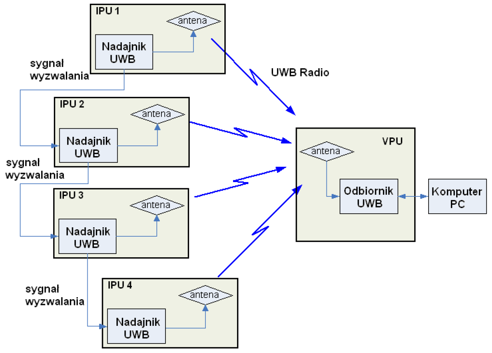

### Sygnały w łączu radiowym

W łączu radiowym systemu nadawane były pakiety o strukturze przedstawionej na rysunku `img:SygKosinski`.

Preambuła umożliwia wysterowanie układu automatycznej regulacji wzmocnienia. Następnie przesyłana jest komenda STOP, która zatrzymuje pomiar czasu. Bity identyfikatora umożliwiają odbiornikowi rozpoznanie źródła przesyłanego sygnału. Pakiet kończy komenda uruchomiająca pomiar.

# Systemy Cyfrowe

## Klasyczne Systemy Cyfrowe
Koniec ubiegłego wieku przyniósł niesamowity rozwój systemów elektronicznych. Odstąpiono od elektroniki analogowej i zaczęto projektować oraz produkować na masową skalę układy cyfrowe. W fazie projektowania wykorzystywano mechanizmy oparte na algebrze Boola - tworzono opis układu w postaci tablicy prawdy, którą przy pomocy różnorodnych technik optymalizacyjnych (tablice Karnough'a, dekompozycja) sprowadzano do postaci równania boolowskiego. Następnie tworzono realizację równań przy pomocy bramek logicznych, przerzutników, liczników, rejestrów, układów arytmetycznych itd. Fizyczną postać tworzono najczęściej przy pomocy układów scalonych firmy Texas Instruments z serii TTL 74xx, które dostarczały gotowe implementacje większości podstawowych struktur logicznych. W trakcie budowania systemu w rolą konstruktora było odpowiednie poprowadzenie ścieżek między wejściami i wyjściami układów.

`wstawic wykres ze strony 29 JEZYKA VHDL`

Rozwój systemów pociągnął za sobą znaczne skomplikowanie układów cyfrowych, co spowodowało że dotychczasowe metody przestały być wystarczające. Długi czas projektowania i skomplikowane prototypowanie uniemożliwało szybkie tworzenie nowego sprzętu. W poszukiwaniu nowych mozliwości realizacji elektroniki cyfrowej wynaleziono układy programowalne.

## Logika Programowalna
Pierwsze układy logiki programowalnej to tzw. układy PAL (*Programmable Array logic*). Ich wewnętrzna budowa składała się z matrycy bramek AND oraz matrycy bramek OR, gdzie matryca iloczynów była programowalna, natomiast matryca OR - połączona na stałe. 

`przykład struktury - najlepiej z jakiegoś datasheeta`

Dowolne kombinacje połączeń wewnątrz struktury umożliwiały realizację bardziej skomplikowanych funkcji w łatwiejszy sposób. Po raz pierwszy wykorzystano oprogramowanie komputerowe typu CAD (*Computer Aided Desiegn*), które wspomagało projektanta w trakcie tworzenia układu. Zmieniło się podejście do samego procesu projektowania.

`schemat - strona 37`

Konstruktor nie musiał samemu realizować połączeń między bramkami, gdyż zajmowało się tym oprogramowanie, które dostarczało gotową "mapę przepaleń" połączeń wewnętrzych układu PAL.

Wykorzystanie układów logiki programowalnej miało wiele zalet. Przede wszystkim uwolniło projektanta od konieczności schodzenia do poziomu bramek logicznych, gdyż zajmowało się tym oprogramowanie. System wymagający wielu modułów TTL mógł składać się z jednego układu scalonego realizującego tę samą funkcję pracując szybciej. Ograniczono pobór energii oraz wymagane miejsce na płytce. 

Względy ekonomiczne również przemawiały za układami PAL. Projekty mogły być realizowane i weryfikowane znacznie szybciej, co ograniczało koszty. Dzięki elastyczności tych modułów zmiany w działaniu systemu wymagały tylko zmiany "mapy przepaleń", natomiast sama płytka drukowana pozostawała bez zmian. Możliwe było stworzenie uniwersalnych płytek ewaluacyjnych umożliwiających łatwe prototypowanie układu. 

## CPLD	
Kolejnym krokiem w rozwoju programowalnych struktur logicznych było pojawienie się układów typu CPLD (*Complex Programmable Logic Device*). Ich struktura składa się z zestawu bloków logicznych wraz z częścią odpowiedzialną za połączenia wewnętrzne. Każdy z bloków składa się z:

* matrycy elementów iloczynowych,
* bloku sumy logicznej,
* makrokomórek.

`schematy, s59`

Blok odpowiedzialny za połączenia programowalne może być realizowany na dwa sposoby:

1. połączenia oparte na matrycy, gdzie wyjścia każdego z bloków łączone jest do matrycy poprzez element pamiętający (komórka EPROM); ponadto istnieje możliwość zrealizowania wszystkich połączeń, tj. dowolne wejście może być połączone z dowolnym blokiem logicznym.
1. połączenia oparte na multiplekserze, gdzie każdemu wejściu bloku logicznego odpowiada jeden multiplekser, a linie adresujące są programowane tak, aby zapewnić odpowiednie połączenia.

Bloki logiczne swoją strukturą przypominają układy typu PAL. Jego rozmiar, określony liczbą wejść i makrokomórek, definiuje możliwości. Bloki te  zawierają zwykle od 4 do 20 makrokomórek, przy czym wystarczy ich 16 aby realizować szesnastobitowe funkcje logiczne w jednym bloku.

Makrokomórki składają się z przerzutników oraz układów sterowania polaryzacją, dzięki czemu można realizować zarówno funkcje proste jak i zanegowane. Dodatkowo układ CPLD często posiada makrokomórki we/wy, które stanowią bufor i zabezpieczenie w interfejsie I/O.

Układy CPLD posiadają również inne, ciekawe własności. Oferują często konstruktorowi standard ISP (*In System Programmability*), który umożliwia programowania układu bezpośrednio w systemie bez konieczności umieszczania elementu w programatorze. Dodatkowo, nowsze układu implementują standard JTAG, który umożliwia debuggowanie i testowanie układu pracującego w systemie.

## FPGA
**Field Programmable Gate Array** to układy, których architekturę wewnętrzną tworzy matryca komórek logicznych, które komunikują się między sobą poprzez linie poprowadzone w kanałach połączeniowych. Komórki logiczne najczęściej posiadają 4 wejścia i potrafią zrealizować dowolną funkcję logiczną czterech wejść. Wewnątrz składają się z:

* tablicy typu LUT (*Look Up Table*),
* sumatora,
* przerzutnika typu D.

Przy projektowaniu układów typu FPGA konstruktor może tworzyć aplikację na jeszcze wyższym poziomie abstrakcji - tj. wyższym niż bramki logiczne i równania boolowskie. Wykorzystuje się w tym celu języki opisu sprzętu HDL (*Hardware Description Language*, np. *VHDL*, *Verilog*, *AHDL*), które umożliwiają stworzenie opisu behawioralnego. Do zaprogramowania konfiguracji FPGA należy wykorzystać środowisko dostarczone przez konkretnego dostawcę układu (np. Xilinx - ISE Web Pack, Altera - Quartus). Implementacja składa się z kilku etapów:

1. Synteza - zamiana opisu w języku typu HDL do strukury bramek logicznych,
1. Place&Route - proces polegający na dopasowaniu zsyntezowanego układu do komórek logicznych oraz realizacji odpowiednich połączeń.

Środowski do projektowania umożliwia także bardzo dokładną symulację oraz testowanie.

`więcej...`

### Spartan 3

* kilka informacji z datasheetow
* specyficzne, fajne zastosowania
* ISE WEB PACK 
* są także inni dostawcy

## Język VHDL

* rownolegle
* mozliwosc modelowania na 3 rozne sposoby
* mozliwosc stworzenia ukladu VLSI na podstawie opisu
* verilog (jest :))

# System sterowania nadajnikiem (częśc hardware\'owa)

## Usprawnienia dotychczasowego systemu??

Najważniejszym celem pracy inżynierskiej jest usprawnienie i rozszerzenie funkcjonalności omówionego wcześniej systemu, który mimo iż działał bardzo dobrze, nie był pozbawiony wad. Głównym problemem, który pojawiał się w trakcie eksploatacji, był brak możliwości szybkiej zmiany parametrów systemu. Każdy z nadajników posiadał zintegrowany układ CPLD, w którego pamięci zapisane zostały prametry konfiguracyjne. Rozwiązanie to jest bardzo wygodne z punktu widzenia konstruktora - tworzymy kilka takich samych układów, które różnią się tylko bitami zapisanymi w pamięci. Jednakże drobna zmiana parametrów wymaga programowania każdego z układów oddzielnie. Jeśli gniazdo JTAG zostało dodatkowo umieszczone w trudno dostępnym miejscu - nie jest to proces łatwy. Ponadto dla każdej z konfiguracji CPLD należy przeprowadzić syntezę układu, co powodowało duże nakłady czasowe. Taki proces uniemożliwiał wręcz przeprowadzanie wydajnych eksperymentów ze względu na:

* czas dokonywanych zmian,
* problemy z programowaniem każdegu układu z osobna.

Istotnym problemem była także niedoskonała sekwencja bitów przesyłana w łączu radiowym. Bitów sterujących było zbyt mało, a preambuła każdego z pakietów nie spełniała do końca swojej roli. Przetwornik A/C umieszczony w pętli ARW wymaga dłuższej sekwencji taktowanej wyższym zegarem. Poszerzenie liczby bitów poprawia także 

W związku z tymi problemami zdecydowano się wprowadzić udoskonalenia, które zlikwidują wyżej wymienione błędy przy jednoczesnym zachowaniu wszystkich funkcji układu

Jednym z możliwych rozwiązań jest wprowadzenie centralnego układu sterującego  który zapewni:

* sterowanie sekwencyjnym uruchamianiem nadajników UWB,
* możliwość ustawienia parametrów konfiguracyjnych układu w jednym miejscu,
* łatwą rozbudowę i skalowalność,

W omawianej koncepcji rolę centralnego sterownika pełni układ FPGA wraz z odpowiednią konfiguracją oraz układami wejścia-wyjścia, które zostaną przedstawione w kolejnych rozdziałach. 

## Architektura systemu
Modyfikacja systemu wymagała opracowania nowej architektury, która wyeliminuje problemy powstałe w poprzedniej realizacji. Zdecydowano odejść od połączenia pierścieniowego nadajników na rzecz połączenia w gwiazdę wraz z centralnym układem sterującym.

Takie połącznie posiada zdecydowanie więcej zalet, kosztem niewielkiej komplikacji układu. Do każdego z nadajników można wysyłać niezależnie i sekwencyjnie (bądź równolegle) sygnały, których parametry ustawia się w sterowniku. Każdy z modułów radiowych otrzymuje sygnał zegarowy bezpośrednio z sterowniku, dzięki czemu system jest niezależny od jitteru wprowadzanego przez każde z urządzeń (jitter nie sumuje się, tak jak w poprzedniej wersji).

`img:archSystemu`

Poglądową architekturę systemu zaprezentowano na rysunku `img:archSystemu`. Układ FPGA pełni główną funkcję sterującą. Operator systemu `może ustawiać parametry` oraz wyzwolić działanie systemu. Sterownik generuje odpowiednie sygnały `(zgodnie z ustawieniami)` wysyłając je na wyjścia, po czym następuje konwersja standardu przesyłania danych do potrzeb linii transmisyjnych oraz odbiorników. Z konwertera sygnały przesyłane są kablami w standardzie RJ45 (4 pary symetryczne) do rozdzielaczy, gdzie są przekazywane do odpowiednich nadajników.

## Moduł FPGA

## Moduł konwertera CMOS - LVDS
Układ FPGA Spartan3 firmy Xilinx posiada wyjścia w prostym i popoularnym standardzie CMOS, w którym:

* stan wysoki => 3,3V `marginesy`
* stan niski => 0V

Taki sposób kodowania stanów logicznych jest bardzo dobry dla układów pracujących blisko siebie z krótkimi połączeniami. Jednakże przy przesyłaniu sygnałów długimi kablami nie zdaje on egzaminu, gdyż jest bardzo wrażliwy na zakłócenia elektromagnetyczne. `co jeszcze?`

W związku z tym zdecydowano, iż do transmisji sygnałów sterujących zostanie wykorzystany różnicowy standard przesyłania danych LVDS (`patrz podrozdział LVDS`). Konwerter sygnałów został zrealizowany jako moduł na oddzielnej płytce drukowanej ze złączem umożliwiającym łatwe dołączenie do bazowej płytki z układem FPGA.

`img:pcbSchemat`

Do konwersji wykorzystano układy MAX9157 firmy Maxim, które:

* obsługują cztery kanały transmisji CMOS -> LVDS lub LVDS -> CMOS,
* umożliwiają transmisję strumieni o przepływności do 200Mbps,
* odbierają sygnały różnicowe o poziomach od 100mV aż do Vcc,
* posiadają obwody zabezpieczające wejścia (fail-save input).

Możliwości te sprawiają, że układu MAX9157 są bardzo dobrymi elementami do budowy interfejsów do przesyłania danych długimi kablami.

Ze względu na dużą liczbę peryferiów umieszczonych na płytce z FPGA omawiany konwerter nie może być przez nią zasilony. Zdecydowano, że zasilanie konwertera zostanie zrealizowane `od strony nadajników`. Do wolnej pary (do transmisji danych wykorzystano tylko 3 z 4 par) podłączone zostanie napięcie zasilania oraz masa. Potencjały te są podłączone z obu rozdzielaczy jednocześnie i są połączone poprzez diody oraz filtry złożone z kondensatora i perełki ferrytowej, którego celem jest odfiltrowanie wszelkich zakłóceń oraz separacja potencjałów analogowych i cyfrowych (aVcc, aGnd, Vcc, cGnd).

`img:pcbLayout`

Zaprezentowany na rysunku `img:pcbLayout` layout płytki został stworzony w programie Altium Designer 6. Rozmieszczenie wyprowadzeń w układach MAX9157 jest bardzo przyjazne dla konstruktura i ułatwia prowadzenie ścieżek (wejścia po jednej stronie, wyjścia po drugiej, przecięcie płaszyczyny masy idealnie w połowie układu). Mimo to nie obyło się bez problemów z poprowadzeniem zasilania, co wymusiło dolutowanie zwor do płytki.

`img:pcbPhoto`

Uruchamianie układu konwertera przebiegło `z problemami/bez większych problemów`. Pierwszym krokiem było sprawdzenie doprowadzeń zasilania poprzez podłączenie napięcia stałego do ścieżek rozprowadzających je po układzie. Napięcie na wyjściu stabilizatora wyniosło 3.3V.

`dalej...`

## Struktura generowanych sygnałów ##

### Przekaz informacyjny ###
System lokalizacyjny, do realizacji swoich funkcji, wykorzystuje sekwencje sygnałów przesyłanych w łączu radiowym. Nadajniki przesyłają zestandaryzowane sekwencje bitów, których każde pole składowe reprezentuje wykonanie odpowiednich procedur w odbiorniku. Po detekcji przesyłanej sekwencji odbiornik realizuje funkcję określoną przez ciąg bitów. Struktura logiczna przesyłanych danych została zaprezentowana na rysunku `img:SchPak1`.

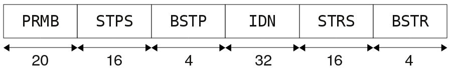

### Funkcje bitów ###
W schemacie pakietu informacyjnego możemy wyróżnić kilka pól, które uruchamiają odpowiednie funkcje odbiornika. Są to:
* PRMB
* STPS
* BSTP
* IDN
* STRS
* BSTR

Każdy z nich odpowiada za inicjalizację odpowiedniego procesu w odbiorniku, które po zakończeniu umożliwiają określenie różnicy czasów propagacji sygnałów i finalnie obliczenie pozycji. 

1. **PRMB** - preambuła. Składa się z ok. 20 impulsów. Nie niesie treści informacyjnej, jednakże jest bardzo istotna z energetycznego punktu widzenia. Umożliwia bowiem układom odbiornika określenie poziomu sygnału, z jakimś będą transmitowane kolejne bity. Wejściowy układ *ARW* (ARW - Automatyczna Regulacja Wzmocnienia) dostosowuje parametry wzmacniacza wejściowego do poziomu mocy odebranej preambuły. Po ustaleniu tych parametrów odbiornik jest gotowy do odebrania i detekcji kolejnych bitów, które już niosą konkretną treść informacyjną.
1. **STPS** - odblokowanie zatrzymania pomiaru czasu.
1. **BSTP** - zatrzymanie pomiaru czasu.
1. **IDN** - identyfikator nadajnika. Długość tego pola (32 bity) wynika ze sposobu realizacji pomiaru przez układy odbiornika. Wykorzystany do pomiaru `nazwa scalaka realizującego pomiar` wymaga odpowiedniego czasu, aby wystawić na swoje wyjścia wynik pomiaru oraz przygotować się do realiazacji kolejnego pomiaru.
1. **STRS** - odblokowanie uruchomienia pomiaru czasu.
1. **BSTR** - uruchomienie pomiaru czasu.

Krótkiego wyjaśnienia wymaga kolejność transmitowanych pakietów - najpierw pomiar jest zatrzymywany, a później dopiero uruchamiany. Jest to konsekwencja zastosowanego systemu TDOA, gdzie mierzone są różnice czasów dotarcia sygnałów od poszczególnych nadajników. 

### Parametry czasowe ###

System transmisyjny oraz charakterystyka kanału radiowego narzucają określone wymagania co do parametrów parametrów czasowych przesyłanych sekwencji.

Na rysunku `img:kanalRadiowy - rysunek poglądowy ściągnięty z internetu` przedstawiono przykładową charakterystykę odpowiedzi impulsowej kanału radiowego po pobudzeniu impulsem UWB. Można zauważyć kilka charakterystycznych fragmentów. Pierwszy, wyraźny pik jest sygnałem, który dotarł bezpośrednio od nadajnika do odbiornika. Po krótkiej przerwie pojawiają się kolejne fragmenty sygnału, które powstały poprzez niekorzystne zjawisko propagacji wielodrogowej (sygnał nadany odbija się od dużych (w stosunku do długości fali) obiektów i dociera do odbiornika z opóźnieniem). Te składowe mogą zaburzyć poprawność odbioru, gdyż urządzenie odbiorcze nie jest w stanie rozróżnić impulsów bezpośrednich od odbitych. 

W związku z powyższym faktem na etapie projektowania sygnałów transmitowanych drogą radiową należy zwrócić szczególną uwagę na odstęp miedzybitowy. Odpowiedni jego dobór jest kompromisem pomiędzy czasem działania systemu (krótki odstęp), a uchronieniem się od składowych wielodrogowych (większy odstęp). W trakcie badań poprzedzających projektowanie systemu stwierdzono, iż dla zakładanych warunków pracy odstęp międzybitowy na poziomie *200-300 \[ns\]* jest całkowicie wystarczająćy i skutecznie wyeliminuje omawiany problem.

Z określonego odstępu międzybitowego wynika wprost częstotliwość z jaką należy generować impulsy i zawiera się w przedziale 3.33 - 5 \[MHz\]. Powyższym rozważaniom nie podlega jednak sygnał preambuły, który nadawany jest z czasem powtarzania impulsów równym *20 \[ns\]*, wobec czego częstotliwość taktowania układów generowania preambuły wynosi 50 \[MHz\].

### Modulacja ###

Do przesyłania danych w łączu radiowych często wykorzystuje się modulację *OOK* (OOK - On-Off Keying), której ideę prezentują rysunki `img:OOK1` oraz `img:OOK2`

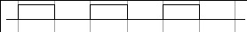

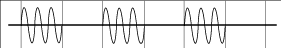

Według teorii logicznej jedynce odpowiada wysłanie nośnej (lub, tak jak w omawianym przypadku, impulsu UWB). Brak sygnału to logiczne zero.

W omawianym systemie zastosowano zmodyfikowaną wersję tej modulacji. W łączu radiowym transmitowane są sygnału UWB, w związku z czym logicznej jedynce odpowiada generacja impulsu; natomiast logiczne zero to brak nadawania. Zastosowane generatory UWB są wyzwalane narastającym zboczem sygnału wejściowego. W związku z tym, należy im dostarczyć przebieg wejściowy, który zmieni swój stan z 0 na 1 w momencie pożądanej generacji. Ma to istotne znaczenie z punktu widzenia kształtowania sygnałów w układzie FPGA.

## Standard LVDS

Do transmisji danych w kablach doprowadzających sygnały do generatorów stosowany jest standard LVDS `(rys. img:LVDS)`. Jest to różnicowy sposób transmisji danych, gwarantujący:

* wysoką energooszczędność,
* wysoką przepływność,
* ochronę przed zakłóceniami elektromagentycznymi.

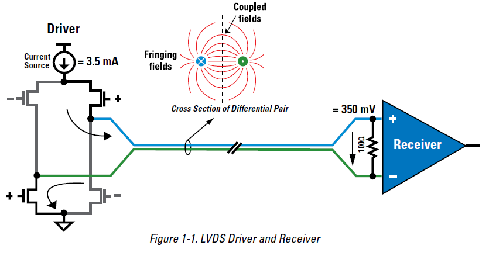

`bib:LVDS` Różnicowy standard transmisji polega na wykorzystaniu dwóch skręconych żył jako linii sygnałowych (o dwóch różnych polaryzacjach) zamiast po jednej sygnałowej i masy. Nadajnik wpuszcza prąd o małym natężeniu (zazwyczaj *i = 3.5 \[mA\]*), który w odbiorniku przepływa przez rezystor dopasowujący wejście do linii transmisyjnej (zazwyczaj *R = 100 - 150 \[ohm\]*). Pierwszym stopniem odbiornika jest wzmacniacz o wejściu różnicowym o dużym wzmocnieniu składowej różnicowej, co zapewnia poprawny odbiór niewielkich sygnałów. Ponadto takie układy posiadają duże tłumienie składowej wspólnej (sumacyjnej), co chroni przed zakłóceniami elektromagnetycznymi. Jeśli takowe występują to wywołują zakłócenia w obu liniach sygnałowych jednocześnie.

# Konfiguracja FPGA (część software\'owa)
## Wprowadzenie
Opisane w rozdziale `Programowalne układy cyfrowe` struktury FPGA są bardzo wygodnym narzędziem do budowania elektronicznych systemów cyfrowych. Dzięki możliwości zaimplementowania wielu klasycznych elementów (liczniki, rejestry, automaty stanów) i szerokiego ich rozszerzania można zaprojektować nawet bardzo złożone układy. Podział na struktury hierarchiczne ułatwia zarówno budowanie układu jak i jego późniejszą analizę.

## Interfejs zewnętrzny i opcje konfiguracyjne
`opisanie sterowania układem, brak implementacji póki co`
`jakie stany (elektryczne i logiczne) co wyzwalają`
`poziomy napięć?`
* `clk_in` - wejście sygnału zegarowego wraz z buforem zapewniającym optymalną propagację sygnału w układzie
* `start` - sygnał, którym użytkownik może uruchomić układ
* `rst` - sygnał resetu asynchronicznego
* `przesuniecia`
* `wyjścia` - sześć wyjść wygenerowanych sygnałów 

## Top module
Na najwyższym stopniu hierarchii projektu znajduje się element `top module`. Układ ten definiuje wszystkie wymienione wcześniej wejścia, wyjscia oraz połączenia między poszczególnymi blokami składowymi. Na rysunku `img:topModule` możemy wyróżnić
* `automat` - który steruje działaniem pozostałych bloków,
* `trx1..6` - zestaw bloków generujących sygnały do poszczególnych nadajników,
* `dzielniki częstotliwości` - bloki umożliwiające dostosowanie częstotliwości sygnału zegarowego do potrzeb różnych bloków funkcjonalnych

### Automat sterujący

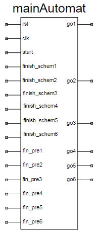

Bloki generujące sygnały są sterowane przez automat zarządzający, który:

* czeka na polecenie użytkownika do rozpoczęcia generacji,
* uruchamia pierwszy generator,
* czeka na informację zwrotną, po otrzymaniu której uruchamia kolejny generator
* analogicznie uruchamia kolejne generatory
* `umożliwia generację pojedynczą lub ciągłą`
* `umożliwia sterowanie odstępem międzybitowym`

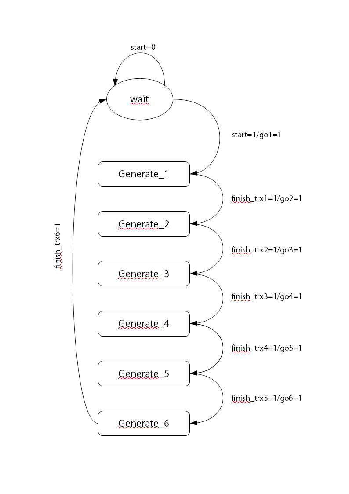

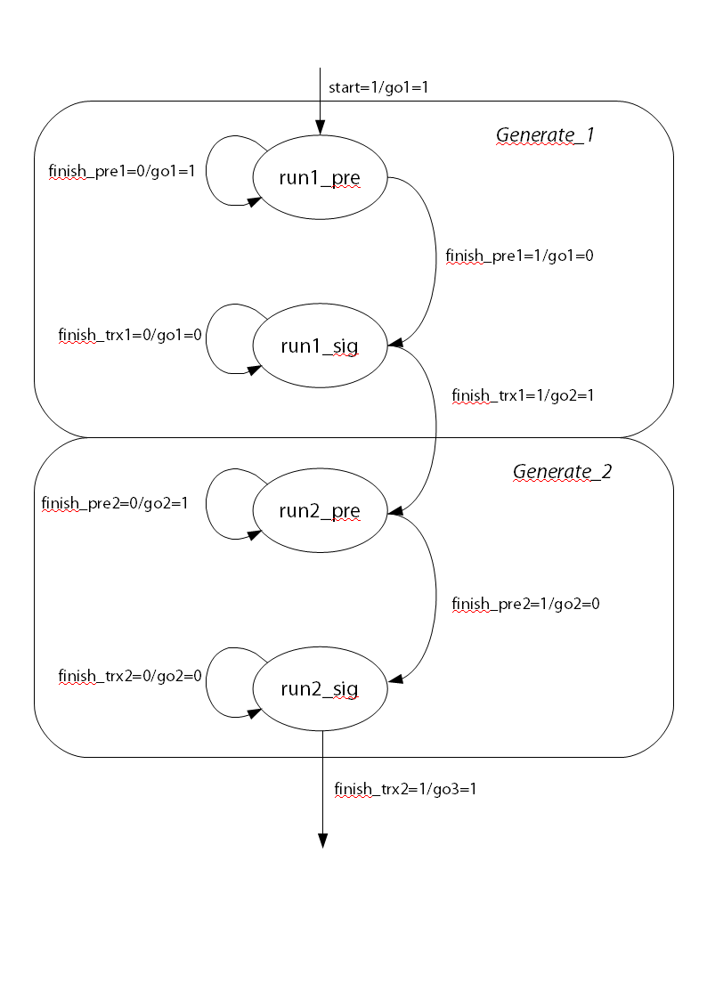

Na pierwszym z powyższych rysunków zaprezentowano diagram stanów automatu sterującego, gdzie każdy proces generacji opisano pojedynczym stanem. Drugi z rysunków pokazuje fragment pierwszego z uwzględnieniem konkretnych stanów rzeczywistego automatu. Jest to automat typu Mealy'ego, gdyż wyjścia układu zależne są nie tylko od aktualnego stanu, ale także od wartości logicznej sygnałów wejściowych. 

### Dzielniki częstotliwości

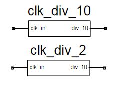

Ze względu na różne czasy trwania generowanych w układzie należy wytworzyć sygnały zegarowe o różnej częstotliwości, przy czym należy pamiętać o zapewnieniu synchronizmu między nimi. Aby to osiągnąć należy wykorzystać elementy, które podzielą częstotliwość o odpowiednią wartość, co skutkuje wydłużeniem czasu trwania okresu zegara. 

Proste dzielniki mogą być wykonane jako złożenie kilku przerzutników. W najtrywialnijszym przypadku dzielenia przez 2 implementacja takiego bloku funkcjonalnego składa się z jednego przerzutnika D oraz negatora wpiętego w pętlę sprzężenia zwrotnego do wejścia D.

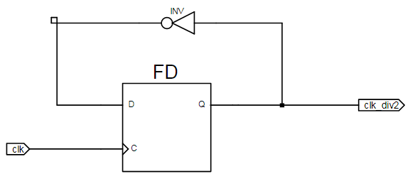

W bardziej złożonych przypadkach warto posłużyć się językiem VHDL, w którym można zaimplementować taki blok, którego współczynnik podziału będzie dowolnie definiowalnym parametrem.

`process (clk_in) begin
	if (clk_in'event and clk_in = '1') then
		if cnt >= DIV_FACTOR then
			div_temp <= not(div_temp);
			cnt <= 0;
		else	
			div_temp <= div_temp;
			cnt <= cnt + 1;
		end if;
		div_10 <= div_temp;
	end if;
	end process;`

## "Single TRX Generator"
Na najwyższym stopniu hierarchii umieszczonych zostało 6 układów generujących pożądane sygnały do poszczególnych nadajników. Układy te reprezentuje makroblok o następującej strukturze:

`img:struktura makrobloku`

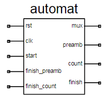

Sygnały wejściowe:
* **clk** - główny sygnał zegarowy synchronizujący pracę układu (100 \[MHz\]),
* **clk preamb** - sygnał zegarowy taktujący generowanie preambuły (`ile?`),
* **clk data** - sygnał zegarowy taktujący generowanie bitów informacyjnych  (`ile?`),
* **start** - wyzwolenie generacji sekwencji bitów,
* **rst** - reset asynchroniczny.

Sygnały wyjściowe
* `out` - główne wyjście generowanej sekwencji,
* `finish_preamb` - sygnał informujący o zakończeniu generacji preambuły,
* `finish` - sygnał informujący o zakończeniu generacji całej sekwencji.

Każdy z nich posiada bliźniaczą wewnętrzną strukturę, która składa się z:

* zestawu wejść,
* automatu sterującego,
* dwóch liczników,
* układu kombinacyjnego,
* multiplekserów wyjściowych.

### Automat sterujący
Pracą makrobloku steruje główny automat, który uruchamia sekwencjnie kolejne bloki zgodnie z diagramem stanów przedstawionym na rysunku `img:diagramStanow`.

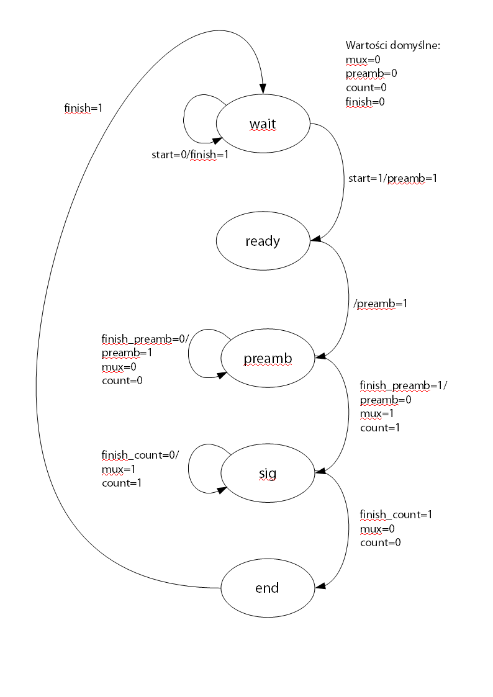

Automat, będąc w stanie początkowym, czeka na wyzwolenie sygnałem start, który pochodzi układów na wyższym poziomie hierarchii. Gdy sygnał ten pojawi się uruchomiona zostaje generacja preambuły.

Za proces ten odpowiada licznik `cnt_20`, który jest taktowany zegarem 50 \[MHz\], co odpowiada częstotliwości sygnału preambuły. Uruchomienie licznika powoduje wysłanie na wyjście `preamb` sygnału o tej właśnie częstotliwości. Wyjściowy multiplekser jest w stanie "0, czyli sygnał preambuły pojawia się na pinie `out` makrobloku. 

Po przepełnieniu licznika `cnt_20` wysyłany jest impuls potwierdzający do głównego automatu. Zmiana stanu rozpoczyna kolejny proces - generację sekwencji informacyjnej - poprzez uruchomienie licznika `cnt_72`, którego wyjście adresuje tablicę prawdy. Odpowiedź `układu pamięciowego` przechodzi przez multiplekser `kształtujący` oraz wyjściowy, którego stan główny automat ustawił na "1". Na wyjściu `out` pojawia się sekwencja bitów informacyjnych.

### ROM 

Sekwencja informacyjna, przesyłana do każdego z nadajników, posiada unikalny charakter i musi być zapisana w konfiguracji układu. Należało zatem wprowadzić element, który przechowywałby dane oraz umożliwiał w łatwy sposób ich ewentualną zmianę.

Rozważano zastosowanie specyficznych dla układów z rodziny Xilinx Spartan3 rozwiązań, które umożliwiają wygnerowanie w strukturze FPGA pamięci typu *Read Only Memory*. Jednakże, ze względu na małą uniwersalność takiej realizacji, zdecydowane o stworzeniu prosztszej i bardziej "przenośnej" implementacji. Zamiast pamięci ROM użyto klasycznego układu kombinacyjnego w postaci tablicy prawdy. Jej opis w języku VHDL nadaje uniwersalności i pozwala przeprowadzić syntezę dla dowolnych układów FPGA.

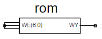

Z punktu widzenia zacisków wejściowych i wyjściowych układ zachowuje się identycznie jak pamięć ROM.

#### Generator tablicy prawdy

Przenośność powyższego rozwiązania osiągnięta przez realizację w języku VHDL pociąga za sobą małą czytelność kodu (dla osoby nieznającej tej technologii) oraz `    `. Aby ułatwić edycję parametrów stworzono prosty program w języku Java, który umożliwia automatyczne wygnerowanie pliku VHDL opisującego daną tablicę prawdy.

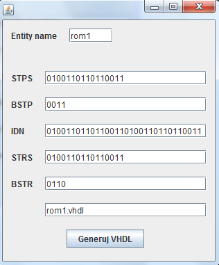

Po uruchomieniu programu wystarczy uzupełnić pola:
* `entity` - nazwa danego bloku,
* wartości bitów każdego z bloków,
* nazwa pliku.

Naciśnięcie przycisku `generuj` utworzy w katalogu programu plik opisujący tablicę prawdy z ustawionymi przez użytkownika parametrami.

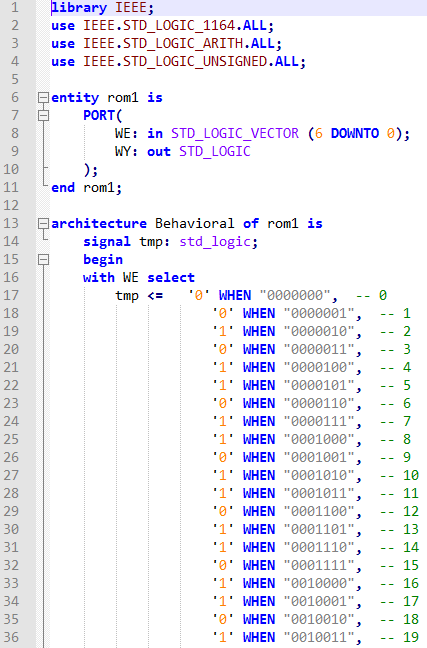

### Multipleksery wyjściowe
Zapewnienie generacji impulsu przy każdym wystąpieniu jedynki logicznej wymaga odpowiedniego zakodowania sygnału na wyjściu układu FPGA - każdej jedynce musi odpowiadać narastające zbocze. Zrealizowanie takiego kodowania jest możliwe na kilka sposobów.

W pierwszym podejściu połączono wyjście informacyjne z sygnałem zegarowym o odpowiedniej częstotliwości zwykłą bramką AND. Z punktu widzenia logiki boolowskiej oraz symulacji behawioralnych rozwiązanie to jest poprawne. W rzeczywistym układzie jednak powodowało to pewne problemy - na wyjściu bramki pojawiały się "szpilki" w trakcie opadającego zbocza zegarowego, które mogłyby wyzwolić generatory UWB.

W związku z tym zastąpiono bramkę AND multiplekserem przystosowanym do przełączania sygnałów zegarowych (specyficznego dla układu Spartan3). 

`rysunek!!!!`

### Realizacja regulacji przesunięć

### Testowanie

## Interfejs 
# Badania układu
## Pomiary oscyloskopowe
## Interfejs radiowy?
# Dodatki
## Bibliografia
* `bib:LVDS` Low-Voltage Differential Signaling, International Engineering Consortium, 

