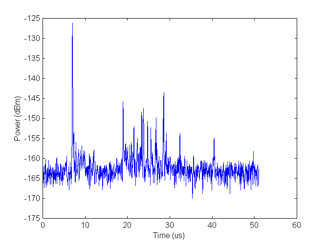
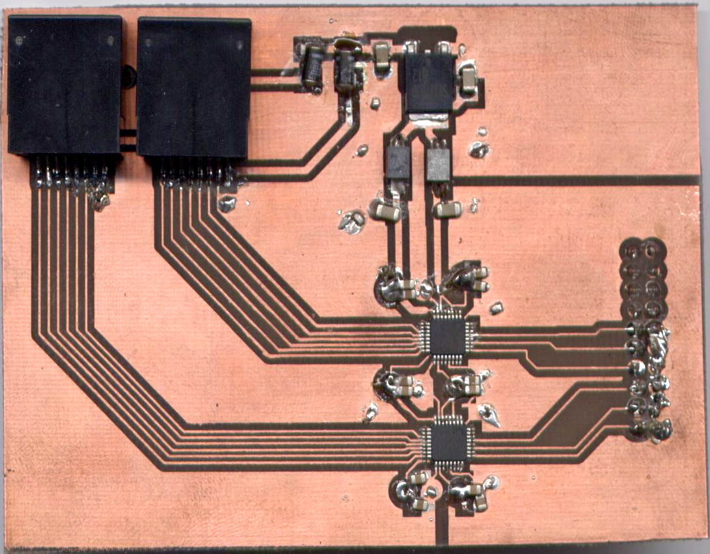

* Table of contents
{:toc}

___

# 1. Wstęp  

# 2. Systemy lokalizacyjne UWB

## 2.1. Sygnały UWB 

### 2.1.1. Charakterystyka
UWB (Ultra Wide Band) to technologia umożliwiająca przesyłanie sygnałów radiowych o bardzo dużej szerokości pasma. Według norm FCC (Federal Communications Commission) sygnał ultraszerokopasmowy posiada względną szerokość pasma (określoną jako pasmo 10dB spadku od poziomu składowej o częstotliwości środkowej) większą od 20% lub bezwzględną szerokość pasma większą od 500MHz. W Europie, gdzie organem regulującym jest Komisja Europejska, sygnałem ultraszerokopasmowym nazywamy taki, którego bezwględna szerokość pasma jest większa już od 50MHz.

Zgodnie z twierdzeniem Shannona maksymalna możliwa do osiągnięcia przepływność transmisji informacji jest wprost proporcjonalna do bezwzględnej szerokości pasma sygnału. W związku z tym sygnały UWB mają potencjalnie bardzo duże możliwości z punktu widzenia przesyłania strumieni danych o dużej przepływności. Dodaktowo szerokie pasmo umożliwia ograniczenie mocy nadawanego sygnału, dzięki czemu urządzania wykorzystujące UWB do transmisji radiowej będą bardziej energooszczędne. Dzięki impulsowej pracy i niewielkim mocom sygnałów systemy te mogą pracować w zajętych już pasmach będąc praktycznie niewykrywalne przez osoby postronne.

Transmisja radiowa wykorzystująca UWB ma przed sobą ciekawą przyszłość. Dzisiejsze mobilne systemy są coraz bardziej miniaturyzowane i narzucane są na nie wysokie wymagania dotyczące zużycia energii. Ponadto urządzania stają się coraz bardziej multimedialne, w związku z czym rosną oczekiwania co do obsługiwanych przepływności strumieni danych. Wprowadzenie systemów UWB do transmisji danych na pewno ułatwi producentom sprzętu spełnienie rosnących wymagań.

UWB to jednak nie tylko transmisja danych, ale także (a z punktu widzenia tej pracy - przede wszystkim) systemy lokalizcyjne. Szczególnie interesujące są rozwiązania umożliwiające lokalizację wewnątrz pomieszczenia. Potencjalne możliwości to m.in.:

* lokalizacja i badanie przemieszczania się pracownika,
* lokalizacja sprzętu, badanie zakresu jego wykorzystania,
* systemy alarmowe,
* lokalizacja funkcjonariuszy (bezpieczeństwo).

Wykorzystanie systemów ultraszerokopasmowych do tych celów ma wiele korzyści. Przede wszystkim niskie poziomy i impulsowy charakter pracy umożliwia pracę obok innych systemów bez zakłóceń. Aktualne regulacje prawne nie umożliwiają jednak pracy takich systemów w otwartej przestrzeni. 

### 2.1.2. Propagacja
Istnieje wiele modeli umożliwiających analizę propagacji sygnałów radiowych w przestrzeni. Najprostsze z nich można zastosować jedynie w sytuacji bezpośredniej widoczności (LOS) i trasy, która nie wpływa w żaden sposób na sygnały. Niestety w rzeczywistości występują różne niekorzystne zjawiska powodujące degradację sygnału odbieranego. Aby dokonać prawidłowej analizy sytuacji, należy wykorzystać model najlepiej oddający warunki występujące w badanym systemie. 

Systemy wykorzystujące UWB pracują najczęściej w środowisku zamkniętym. W związku z tym największy wpływ na odbierany sygnał mają zjawiska:

* wielodrogowości,
* zaniki o rozkładzie innym niż Reyleigha.

`wzór na model`

Do opisu propagacji sygnałów UWB najlepiej wykorzystać model *Saleh-Valenzuela*. Uwzględnia on bardzo bogaty profil wielodrogowości, gdyż sygnały, w zależności od środowiska propagacyjnego, mogą docierać różnymi drogami. Elementy powodujące odbicia mogą mięć różny wpływ na sygnały w zależności od ich częstotliwości, co w efekcie powoduje zmianę kształtu impulsu w punkcie odbioru. Model zmienia także standardowe zaniki Rayleigha na czynnik o charakterze rozkładu logarytmicznie normalnego, który lepiej oddaje charakter kanału dla sygnałów UWB.

Typowa odpowiedź kanału radiowego pobudzonego impulsem UWB została zaprezentowana na rysunku 2.1. Można zauważyć charakterystyczne problemy, dotyczące takich sygnałów:

* kilka wyraźnych pików docierających różnymi drogami,
* krótki impuls wygnerowany w nadajniku wyraźnie wydłużył się po przejściu przez kanał radiowy.

W związku z tym należy pamiętać o zachowaniu odpowiedniego odstępu międzybitowego w projektowanych systemach wykorzystujących UWB, aby ustrzec się przed problemami związanymi z propagacją sygnału w łączu radiowym.

## 2.2. Systemy TDOA
Systemy lokalizacyjne jeszcze do niedawna kojarzyły się głównie z lotniczymi i wojskowymi radarami. W dzisiejszych czasach lokalizacja urządzeń coraz śmielej wkracza w różne dziedziny życia bliskie każemu człowiekowi. Dobrym tego przykładem tego zjawiska jest telefonia komórkowa, której operatorzy są zobligowani do wprowadzenia technicznych rozwiązań umożliwiających odpowiednim służbom lokalizację terminala. Pojawiają się także systemy, których celem jest określenie dokładnej pozycji i przemieszczenia danego czujnika wewnątrz budynku lub pojedynczego pomieszczenia.
Opracowano wiele technik i modeli matematycznych umożliwiających określenie pozycji w różnych warunkach. Do najbardziej popularnych metod należą:

* RSS (Recieved Signal Strenght) - oparta na pomiarze poziomu mocu sygnału,
* AOA (Angle of Arrival) - oparata na pomiarze kąta nadejścia sygnału,
* TOA (Time of Arrival) - oparta na pomiarze czasu propagacji sygnałów w łączu radiowym
* TDOA (Time Difference of Arrival) - oparta na pomiarze różnicy czasów propoagacji sygnałów w łączu radiowym.

Z punktu widzenia omawianej pracy najistotniejsze jest omówienie ostatniej z wymienionych metod, czyli TDOA. Opiera się ona na wyznaczeniu odstępów czasowych pomiędzy sygnałami docierającymi z różnych węzłów sieci. Na podstawie tych parametrów można obliczyć położenie, które wypada na przecięciu odpowiednik hiberboli (w przestrzeni dwuwymiarowej) lub hiberboloid (w przestrzeni trójwymiarowej).

`rysunek`

Niewątpliwą zaletą systemu TDOA jest brak konieczności synchronizacji zegarów odbiornika z węzłami referencyjnymi, gdyż istotne są tylko różnice w czasie docierających sygnałów. Nie ma zatem konieczności stosowania bardziej wyrafinowanych metod umożliwiających dokładną synchronizację. 

Istnieją dwa warianty omawianej metody. W pierwszej z nich sygnały nadawane są od węzłów referencyjnych w stronę obiektu lokalizowanego, który jest odbiornikiem. Umożliwia to lokalizowanie jednoczesne wielu urządzeń będących w oszarze działania systemu, jednakże komplikuje to budowę odbiornika, w którym należy zaimplementować algorytmy obliczające pozycję. W drugiej wersji to lokalizowane urządzenie jest nadajnikiem, a węzły referencyjne odbierają sygnał. Zaletą tego rozwiązania jest uproszczenie urządzenia lokalizowanego i przeniesienie bloku obliczającego pozycję do jednego z węzłów. Taki system wymaga jednak wprowadzenia mechanizmu wielodostępu, aby móc lokalizować kilka urządzeń na raz. 

Do implementacji systemów lokalizacyjnych bardzo dobrze nadają się sygnały typu UWB. Bardzo krótki czas trwania impulsu umożliwia detekcję czasu odbioru z dużą dokładnością co bezpośrednio przekłada się na dokładność określenia pozycji. Przykładowo (`bilb:wasowski`) w systemach pracujących z szerokością pasma 7.5GHz można osiągnąć rozdzielczość czasową odbioru impulsów rzędu 133ps, co przekłada się na zaledwie 4cm błędu określenia położenia. Natomiast wykorzystując systemy o szerokości pasma 500MHz uzyskujemy rozdzielczość 2ns, która powoduje 60cm błędu określenia pozycji. Można zatem wnioskować, że w dowolnym paśmie UWB >500MHz można uzyskać określenie lokalizacji obiektu z dokładnością mniejszą niż 1 metr, co jest bardzo dobrym wynikiem.

## 2.3. System lokalizacyjny opracowany w PMR IRE

### 2.3.1. Architektura

W ramach programu SAFESPOT w Pracowni Miernictwa Radioelektronicznego Instytutu Radioelektroniki Politechniki Warszawskiej opracowano system lokalizacyjny wykorzystujący opisane wcześniej techniki. Jego ogólną koncepcję przedstawiono na rysunku 2.2/.

System służy do określenia pozycji samochodu, w którym umieszczono odpowiedzialny za dokanie pomiarów odbiornik połączony z komputerem realizującym obliczenia. Częśc nadawcza składa się z pięciu nadajników (układ cyfrowy CPLD, generator UWB oraz antena) połączonych szeregowo (struktura została przedstawiona na rysunku 2.3.). Pierwszy z nich jest nadajnikiem nadrzędnym, który:

* decyduje o rozpoczęciu procesu generacji i wysyłaniu impulsów w łączu radiowym,
* uruchamia kolejny nadajnik,
* jest źródłem sygnału zegarowego.

Każdy z kolejnych nadajników otrzymuje sygnał zegara oraz sygnał wyzwalający. Zegar jest regenerowany i wysyłany dalej, po czym jest używany jako lokalny sygnał zegarowy, dzięki czemu wszystkie nadajniki są ze sobą zsynchronizowane. Po otrzymaniu sekwencji sterującej, każdy nadajnik wysyła impulsy w łączu radiowym, które sterują pracą odbiornika. Odbiornik, zgodnie ze sposobem działania systemów typu TDOA, mierzy różnicę czasów pomiędzy otrzymaniem sygnałów z poszczególnych nadajników. Po wysłaniu sekwencji z ostatniego nadajnika pomiar się kończy i rozpoczyna się etap obliczania pozycji. Proces nadawnia sygnałów jest ciągły, wobec czego obliczana pozycja jest cały czas uaktualniana.

### 2.3.2. Sygnały w łączu radiowym

W łączu radiowym systemu nadawane są pakiety o strukturze przedstawionej na rysunku rys 2.4.

Zrealizowanie odpowiednich pomiarów zapewniają pola *START* i *STOP*. Umieszczenie instrukcji w takiej kolejności wynika ze sposobu pracy systemów typu TDOA, w których mierzona jest różnica czasu między danymi rozkazami, co zostało zaprezentowane na rysunku 2.5.

Aby prawidłowo odebrać i przetworzyć sygnał UWB warto umieścić w odbiorniku układ automatycznej regulacji wzmocnienia. Do jego wysterowania służy preambuła - fragment pakietu, który jest nadawany na początku każdej paczki umożliwiający ustalenie wzmocnienia układu wejściowego odbiornika. Jest to istotnie, ponieważ kolejny stopień, którym jest przetwornik analogowo-cyfrowy, pracuje z sygnałami o ściśle określonych amplitudach.

W pakiecie umieszczono także pole identyfikatora, które umożliwia rozróżnienie sygnałów emitowanych z poszczególnych nadajników.

# 3. Systemy Cyfrowe

## 3.1. Klasyczne Systemy Cyfrowe
Koniec ubiegłego wieku przyniósł niesamowity rozwój systemów elektronicznych. Odstąpiono od elektroniki analogowej i zaczęto projektować oraz produkować na masową skalę układy cyfrowe. W fazie projektowania wykorzystywano mechanizmy oparte na algebrze Boola - tworzono opis układu w postaci tablicy prawdy, którą za pomocą różnorodnych technik optymalizacyjnych (tablice Karnough'a, dekompozycja) sprowadzano do postaci równania boolowskiego. Następnie tworzono realizację równań przy pomocy bramek logicznych, przerzutników, liczników, rejestrów, układów arytmetycznych itd. Fizyczną postać tworzono najczęściej wykorzystując układów scalonych firmy Texas Instruments z serii TTL 74xx, które dostarczały gotowe implementacje większości podstawowych struktur logicznych. W trakcie budowania systemu w rolą konstruktora było odpowiednie poprowadzenie ścieżek między wejściami i wyjściami układów.

Rozwój systemów pociągnął za sobą znaczne skomplikowanie układów cyfrowych, co spowodowało że dotychczasowe metody przestały być wystarczające. Długi czas projektowania i złożone prototypowanie uniemożliwało szybkie tworzenie nowego sprzętu. W poszukiwaniu nowych możliwości realizacji elektroniki cyfrowej wynaleziono układy programowalne.

## 3.2. Układy logiki programowalnej
Pierwsze układy logiki programowalnej to tzw. układy PAL (*Programmable Array Logic*). Ich wewnętrzna budowa składała się z matrycy bramek AND oraz matrycy bramek OR, gdzie matryca iloczynów była programowalna, natomiast matryca OR - połączona na stałe. 

Dowolne kombinacje połączeń wewnątrz struktury umożliwiały realizację bardziej skomplikowanych funkcji w łatwiejszy sposób. Po raz pierwszy wykorzystano oprogramowanie komputerowe typu CAD (*Computer Aided Design*), które wspomagało projektanta w trakcie tworzenia układu. Zmieniło się podejście do samego procesu projektowania.

Konstruktor nie musiał samemu realizować połączeń między bramkami, gdyż zajmowało się tym oprogramowanie, które dostarczało gotową "mapę przepaleń" połączeń wewnętrzych układu PAL.

Wykorzystanie układów logiki programowalnej miało wiele zalet. Przede wszystkim uwolniło projektanta od konieczności schodzenia do poziomu bramek logicznych, gdyż zajmowało się tym oprogramowanie. System wymagający wielu modułów TTL mógł składać się z jednego układu scalonego realizującego tę samą funkcję pracując szybciej. Ograniczono pobór energii oraz wymagane miejsce na płytce. 

Względy ekonomiczne również przemawiały za układami PAL. Projekty mogły być realizowane i weryfikowane znacznie szybciej, co ograniczało koszty. Dzięki elastyczności tych modułów zmiany w działaniu systemu wymagały tylko zmiany "mapy przepaleń", natomiast sama płytka drukowana pozostawała bez zmian. Możliwe było stworzenie uniwersalnych płytek ewaluacyjnych umożliwiających łatwe prototypowanie układu. 

## 3.3. Układy CPLD	
Kolejnym krokiem w rozwoju programowalnych struktur logicznych było pojawienie się układów typu CPLD (*Complex Programmable Logic Device*). Ich struktura składa się z zestawu bloków logicznych wraz z częścią odpowiedzialną za połączenia wewnętrzne. Każdy z bloków składa się z:

* matrycy elementów iloczynowych,
* bloku sumy logicznej,
* makrokomórek.

`schematy, s59`

Blok odpowiedzialny za połączenia programowalne może być realizowany na dwa sposoby:

1. połączenia oparte na matrycy, gdzie wyjścia każdego z bloków łączone jest do matrycy poprzez element pamiętający (komórka EPROM); ponadto istnieje możliwość zrealizowania wszystkich połączeń, tj. dowolne wejście może być połączone z dowolnym blokiem logicznym.
1. połączenia oparte na multiplekserze, gdzie każdemu wejściu bloku logicznego odpowiada jeden multiplekser, a linie adresujące są programowane tak, aby zapewnić odpowiednie połączenia.

Bloki logiczne swoją strukturą przypominają układy typu PAL.  Bloki te zawierają zwykle od 4 do 20 makrokomórek, przy czym wystarczy ich 16 aby realizować szesnastobitowe funkcje logiczne w jednym bloku.

Makrokomórki składają się z przerzutników oraz układów sterowania polaryzacją, dzięki czemu można realizować zarówno funkcje proste jak i zanegowane. Dodatkowo układ CPLD często posiada makrokomórki we/wy, które stanowią bufor i zabezpieczenie w interfejsie I/O.

Układy CPLD posiadają również inne, ciekawe własności. Oferują często konstruktorowi standard ISP (*In System Programmability*), który umożliwia programowania układu bezpośrednio w systemie bez konieczności umieszczania elementu w programatorze. Dodatkowo, nowsze układu implementują standard JTAG, który umożliwia debuggowanie i testowanie układu pracującego w systemie.

## 3.4. Układy FPGA

**Field Programmable Gate Array** to aktualnie najbardziej rozwinięty rodzaj programowalnych układów logicznych, który umożliwia realizację bardzo złożonych struktur. Posiada możliwości identyczne z układami typu ASIC (Application-Specific Integrated Circuit - zintegrowane układy projektowane do zastosowania w konkretnym systemie), dla których często stanowi prototyp. Mimo iż układy FPGA są zazwyczaj wolniejsze i pobierają więcej mocy można je wykorzystywać w wielu aplikacjach jako rozwiązanie ostateczne. Na ich rzecz przemawia krótszy czas projektowania oraz niższe koszty produkcji.

Wewnętrzna struktura typowego układu FPGA została przedstawiona na rysunku 3.3. Możemy na niej wyróżnić:

* bloki wejścia/wyjścia,
* bloki logiczne,
* połączenia programowalne.

Bloki logiczne wraz z programowalnymi połączeniami stanowią o ogromnych możliwościach układów FPGA. Każdy z bloków umożliwia realizację dowolnej funkcji boolowskiej czterech argumentów. Ich wewnętrzna struktura została przedstawiona na rysunku 3.6 i składa się z:

* tablicy typu LUT (*Look Up Table*),
* sumatora,
* przerzutnika typu D.

Tablica LUT realizuję obsługę logiki. W jej strukturze zapisana jest tablica prawdy, do której w trakcie implementacji zostało sprowadzone równanie boolowskie lub opis w języki HDL. Przerzutnik umożliwia synchronizację sygnału wyjściowego z dostarczonym sygnałem zegarowym. Za pomocą multipleksera natomiast można decydować czy odpowiedź na wyjściu ma być synchroniczna czy asynchroniczna. 

Przy projektowaniu układów typu FPGA konstruktor może tworzyć aplikację na jeszcze wyższym poziomie abstrakcji - tj. wyższym niż bramki logiczne i równania boolowskie. Wykorzystuje się w tym celu języki opisu sprzętu HDL (*Hardware Description Language*, np. *VHDL*, *Verilog*, *AHDL*). Do zaprogramowania konfiguracji FPGA należy wykorzystać środowisko dostarczone przez konkretnego dostawcę układu (np. Xilinx - ISE Web Pack, Altera - Quartus). 

### Xilinx Spartan3
Na rynku powszechnie dostępne są układy wielu producentów. Do najbardziej znaczących należą Altera i Xilinx. Realizacja omawianej pracy została oparta na układzie Xilinx Spartan3 XC3S200. Posiada on 4 320 komórek logicznych, co jest odpowiednikiem ok. 200 000 bramek logicznych. Jego struktura jest rozszerzoną wersją omówionej wcześniej koncepcji i została przedstawiona na rysunku 3.7.

Poza podstawowymi elementami, którym są bloki logiczne, możemy wyróżnić także pamięc typu RAM (składająca się z bloków po 18 kilobitów) oraz blok DCM (Digital Clock Manager), który dostarcza wszystkich funkcji niezbędnych z dystrybucją sygnału zegarowego oraz operacjach z nim związanych. Układ posiada 173 linie wejścia/wyjścia, które umożliwiają współpracę z sygnałami przesyłanymi w różnych standardach zarówno asymetrycznych (np. LVCMOS) jak i symetrycznych (np. LVDS).

## 3.5. Język VHDL
Tworzenie skomplikowanych systemów cyfrowych wymaga wykorzytania odpowiednich narzędzi. Opis układu w postaci równań boolowskich jest trudny zarówno dla projektanta jak i osoby, która później może system rozwijać. Języki opisu sprzętu umożliwiają stworzenie opisu działania układu na różnych poziomach abstrakcji, dzięki czemu są bardziej elastyczne i pozwalają szybciej tworzyć skomplikowane struktury. Jednym z dwóch czołowych języków tego typu, obok języka Verilog, jest VHDL (**V**ery-High-Speed Integrated Circuit **H**ardware **D**escription **L**anguage), który został wykorzystany do realizacji projektu w ramach pracy dyplomowej.

Język ten zawiera użyteczne konstrukcje semantyczne, umożliwiające tworzenie jasnego i czytelnego kodu reprezentującego układ logiczny. Projekt może być opisany na wielu poziomach abstrakcji, dzięki czemu programista ma dużą swobodę i elastyczność w tworzeniu konfiguracji FPGA. Język umożliwia kreowanie i ładowanie zewnętrznych bibliotek, a także realizację modułów, które mogą być wielokrotnie wykorzystywane w projekcie (struktura hierarchiczna). Większość instrukcji wykonywana jest równolegle, jednakże istnieją sposoby na stworzenie kodu wykonywanego sekwencyjnie (tzw. procedury) wraz z instrukcjami warunkowymi i pętlami znanymi z klasycznych języków programowania.

Dużą zaletą tej technologii jest uniezależnienie opisu układu od wyboru konkretnego układu, w jakim będzie on później realizowany. Dzięki przenośności istnieje możliwość symulowania i testowania projektu w wielu środowiskach, co ułatwia znalezienie potencjalnych błędów. Układ można poddać syntezie także w dowolnym środowisku do projektowania FPGA.

Niestety, możliwość tworzenia projektu na wysokim poziomie abstrakcji niesie za sobą pewne konsekwencja. Narzędzia do syntezy czasem tworzą nieoptymalną implementację. Jest to często winą samego projektanta, który tworzy kod niezgodny z przyjętymi konwecjami. Co więcej, niedoświadczony programista może napisać kod, który w ogóle nie jest syntezowalny. Z drugiej strony - sama idea tworzenia układu cyfrowego na podstawie opisu w języku HDL powoduje przyjęcie pewnych standardów przez kompilator i generowanie nieoptymalnych rozwiązań w przypadku niecodziennych konstrukcji.

## 3.6. Implementacja 

Implementacja to pełen proces stworzenia układu cyfrowego odpowiadającego naszym oczekiwaniom. W jego wyniku otrzymujemy poprawną konfigurację, którą można zaprogramować układ FPGA i uruchomić w pełni działające urządzenie. Poszczególne etapy implementacji to:

1. Zdefiniowanie założeń i wymagań projektowych,
1. Opisanie projektu w języku typu *HDL*,
1. Symulacja kodu źródłowego,
1. Synteza, optymalizacja i dopasowanie projektu,
1. Symulacja modelu dopasowanego i zrealzowanego projektu,
1. Zaprogramowanie układu.

### 3.6.1. Zdefiniowanie założeń i wymagań projektowych
Każdy projekt techniczny musi zacząć się od zdefniowania konkretnych założeń. Nie inaczej jest w trakcie projektowania systemów cyfrowych. Należy zdefiniować wymagania, szczególnie dotyczące:

* częstotliwości działania układu,
* czasów ustawiania i propagacji sygnałów,
* ścieżek krytycznych.

Jasne sprecyzowanie wymagań ułatwia dobór narzędzi oraz konkretnych układów, w których projekt zostanie zaimplementowany.

### 3.6.2. Opisanie projektu w języku typu *HDL*
Zalecane są 3 metody projektowania:

* zstępująca (top-down),
* wstępująca (bottom-up),
* pozioma.

W omawianym projekcie została wykorzystana pierwsza z nich. Polega na podzieleniu projektu na funkcje składowe, mające określone, specyficzne wejścia i wyjścia oraz realizujące odpowienie funkcje. Moduł na najwyższym stopniu hierarchii spaja wszystkie elementy i umożliwia łatwą analizę działania układu. Takie podejście jest szczególnie korzystne przy tworzeniu skomplikowanych systemów. Oprogramowanie do projektowania układów FPGA umożliwia realizację wielopoziomowych struktur.

Po stworzeniu bloków składowych projektu należy przejść do zakodowania funkcjonalności każdego z nich. 

### 3.6.3. Symulacja kodu źródłowego
Środowiska do projektowania umożliwiają przeniesienie fazy symulacji i testowania do wczesnych etapów tworzenia systemu. Jest to tzw. "symulacja behawioralna", która obrazuje zachowanie układu opisanego językiem HDL bez uwzględnienia wpływu syntezy oraz poprowadzenia połączeń. Można zaobserwować podstawowe zachowanie zrealizowanego projektu, jednakże bez tak kluczowych czynników, jak np. opóźnienia i czasy propagacji.

### 3.6.4. Synteza, optymalizacja i dopasowanie projektu
#### Synteza 
Synteza to proces, w wyniku którego z abstrakcyjnego kodu HDL tworzona jest lista połączeń między blokami realizującymi odpowiednie funkcje logiczne lub zbiór równań boolowskich. Rezultat tej operacji jest zależny od konkretnej technologii, gdyż powinien być dopasowany do konkretnego modelu układu FPGA, w którym projekt będzie implementowany. 

#### Optymalizacja
Proces optymalizacji jest zależny od trzech czynników:

* postaci wyrażeń boolowskich,
* rodzaju dostępnych zasobów sprzętowych,
* ograniczeń projektowych (**ang. constraints**).

Narzędzia do optymalizacji umożlwiają wykorzystanie specyficznych właściowści układu konkretnego producenta w celu zapewnienia najlepszych parametrów wynikowego projektu. Aby tego dokonać mogą korzystać z przekształceń równań boolowskich otrzymanych w wyniku syntezy, aby dokonać optymalnej realizacji. Ograniczenia projektowe narzucone przez użytkownika lub wprowadzone automatycznie umożliwiają efektywniejszą optymalizację pod kątem wykorzystania dostępnych zasobów.

#### Rozmieszczenie i poprowadzenie połączeń
Proces ten ma ogromny wpływ na jakość zrealizowanego układu. Bardzo istotnym parametrem jest czas propagacji sygnałów, na który kluczowy wpływ ma sposób poprowadzenia połączeń, gdyż to one właśnie wprowadzają największe opóźnienia. Programy najwyższej klasy umożliwiają wykorzystanie bloków logicznych leżących blisko siebie, dzięki czemu ścieżki połączeniowe są bardzo krótkie - w szczególności te, których opóźnienie wpływa w krytyczny sposób na parametry układu. 

### Symulacja modelu dopasowanego i zrealzowanego projektu
Dokonanie symulacji bez syntezy układu umożliwia dokonanie wstępnej obserwacji sygnałów. Jednakże dopiero przesymulowania układu po syntezie i rozmieszczeniu w strukturze FPGA oddaje pełny obraz zachowania rzeczywistego projektu. Dzięki niej możemy przeprowadzić nie tylko analizę funkcjonalną, lecz także sprawdzić parametry czasowe, opóźnienia propagacji sygnałów zegarowych i międzyrejestrowych. 

### 3.6.5. Zaprogramowanie układu
Finalny etapem realizacji projektu jest zaprogramowanie układu. Dokonuje się go przy pomocy zewnętrznego urządzanie jakim jest programator wykorzystujący najczęściej standard JTAG.

# 4. System sterowania nadajnikami
## 4.1. Założenia

Celem pracy jest usprawnienie systemu lokalizacyjnego opisanego w rozdziale 2.3., który mimo iż działał bardzo dobrze, nie był pozbawiony wad. Głównym problemem, który pojawiał się w trakcie eksploatacji, był brak możliwości szybkiej zmiany parametrów systemu. Każdy z nadajników posiadał zintegrowany układ CPLD, w którego pamięci zapisane zostały prametry konfiguracyjne. Rozwiązanie to jest bardzo wygodne z punktu widzenia konstruktora - tworzymy kilka takich samych układów, które różnią się tylko bitami zapisanymi w pamięci. Jednakże drobna zmiana parametrów wymaga programowania każdego z układów oddzielnie. Dodatkowo, ponieważ gniazdo JTAG zostało dodatkowo umieszczone w trudno dostępnym miejscu - nie jest to proces łatwy. Ponadto dla każdej z konfiguracji CPLD należy przeprowadzić syntezę układu, co powodowało duże nakłady czasowe. Taki proces uniemożliwiał wręcz przeprowadzanie wydajnych eksperymentów ze względu na:

* czas dokonywanych zmian,
* problemy z programowaniem każdegu układu z osobna.

Istotnym problemem była także niedoskonała sekwencja bitów przesyłana w łączu radiowym. Bitów sterujących było zbyt mało, a preambuła każdego z pakietów nie spełniała do końca swojej roli, gdyż przetwornik A/C umieszczony w pętli ARW (patrz rozdział 2.3.2.) wymaga dłuższej sekwencji taktowanej wyższym zegarem. Powiększenie liczby bitów poprawia także precyzję dekodowania sekwencji w odbiorniku.

W związku z wymienionymi problemami zdecydowano się wprowadzić udoskonalenia, które zlikwidują wyżej wymienione błędy przy jednoczesnym zachowaniu wszystkich funkcji układu.

Jednym z możliwych rozwiązań jest wprowadzenie centralnego układu sterującego  który zapewni:

* sterowanie sekwencyjnym uruchamianiem nadajników UWB,
* możliwość ustawienia parametrów konfiguracyjnych układu w jednym miejscu,
* łatwą rozbudowę i skalowalność,
* zmianę dotychczasowej sekwencji bitów na bardziej wydajną.

W omawianej koncepcji rolę centralnego sterownika pełni układ FPGA wraz z odpowiednią konfiguracją oraz układami wejścia-wyjścia, które zostaną przedstawione w kolejnych rozdziałach. 

## 4.2. Architektura systemu
Modyfikacja systemu wymagała opracowania nowej architektury, która wyeliminuje problemy powstałe w poprzedniej realizacji. Zdecydowano o zmianie połączenia pierścieniowego nadajników na rzecz połączenia w gwiazdę wraz z centralnym układem sterującym.

Takie połącznie posiada zdecydowanie więcej zalet kosztem niewielkiej komplikacji układu. Do każdego z nadajników można wysyłać niezależnie i sekwencyjnie (bądź równolegle) sygnały, których parametry ustawia się w sterowniku. Każdy z modułów radiowych otrzymuje sygnał zegarowy bezpośrednio ze sterownika, dzięki czemu system jest niezależny od jitteru wprowadzanego przez każde z urządzeń (jitter nie kumuluje się, tak jak w poprzedniej wersji).

Poglądową architekturę systemu zaprezentowano na rysunku 4.1. Układ FPGA pełni główną funkcję sterującą i uruchamia się od razu po włączeniu zasilania. Sterownik generuje odpowiednie sygnały wysyłając je na wyjścia, po czym następuje konwersja standardu przesyłania danych do potrzeb linii transmisyjnych oraz odbiorników. Z konwertera sygnały przesyłane są kablami w standardzie Cat 5e (skrętka - 4 pary symetryczne) do rozdzielaczy, gdzie są przekazywane do odpowiednich nadajników.

## 4.3. Moduł FPGA
Płytka uruchomieniowa opracowana w Pracowni Miernictwa Radiokomunikacyjnego z układem Xilinx Spartan3 doskonale nadaje się do realizacji i ewaluacji omawianego systemu. Zawiera wszystkie peryferia, które są niezbędne do niezależnego działania systemu bez konieczności trwałego połączenia z komputerem. Do najbardziej istotnych elementów należą:

* układ FPGA Xilinx Spartan3 XC3S200,
* sekcja zasilająca wyposażona w stabilizatory o odpowiedniej wydajności prądowej,
* pamięć EPROM, do której można wpisać konfigurację FPGA i uniezależnić się od komputera,
* stabilny generator sygnału zegarowego 100MHz,
* zestaw rekonfigurowalnych portów wejścia/wyjścia,
* interfejs JTAG.

Omawiana płytka została przedstawiona na rysunku 4.2.

## 4.4. Moduł konwertera CMOS - LVDS
Układ FPGA Spartan3 firmy Xilinx posiada wyjścia w różnych standardach. Najbardziej uniwersalnym jest CMOS, w którym:

* stan wysoki => 3,3V b
* stan niski => 0V

Taki sposób kodowania stanów logicznych jest bardzo dobry dla układów pracujących blisko siebie z krótkimi połączeniami. Jednakże przy przesyłaniu sygnałów długimi kablami nie zdaje on egzaminu, gdyż jest bardzo wrażliwy na zakłócenia elektromagnetyczne. Ponadto wyjścia układu nie są dopasowane do obciążenia impedancją linii transmisyjnej.

W związku z tym zdecydowano, iż do transmisji sygnałów sterujących zostanie wykorzystany różnicowy standard przesyłania danych LVDS (patrz rozdział 9.1.). Mimo iż sam układ FGPA Spartan3 posiada wyjścia w tym standardzie, to nie można ich wykorzystać ze względu na brak kompensacji długości wszystkich ścieżek na płytce. Konwerter sygnałów został zrealizowany jako moduł na oddzielnej płytce drukowanej ze złączem umożliwiającym łatwe dołączenie do bazowego systemu z układem FPGA.

Do konwersji wykorzystano układy MAX9157 firmy Maxim, które (na podstawie `bibl:datasheetMAX9517`):

* obsługują cztery kanały transmisji CMOS -> LVDS lub LVDS -> CMOS,
* umożliwiają transmisję strumieni o przepływności do 200Mbps,
* odbierają sygnały różnicowe o poziomach już od 100mV,
* posiadają obwody zabezpieczające wyjście przed niepożądanym stanem na wejściu (fail-save input receiver),
* umożliwiają podłączania i odłączanie w trakcie pracy układu (hot-swappable).

Możliwości te sprawiają, że układu MAX9157 są bardzo dobrymi elementami do budowy interfejsów do przesyłania danych długimi kablami.

Ze względu na duży pobór prądu przez nadajniki cały system nie może zostać zasilony przez płytkę z modułem FPGA. Zdecydowano o zastosowaniu dodatkowego zasilacza, który dostarczy odpowiedniej mocy do konwertera oraz nadajników (co zostało zobrazowane na rysunku 4.3.). Do wolnej pary (do transmisji danych wykorzystano tylko 3 z 4 par) podłączone zostanie napięcie zasilania oraz masa. Potencjały te są podłączone z obu rozdzielaczy jednocześnie i są połączone poprzez diody oraz filtry złożone z kondensatora i dławika, którego celem jest odfiltrowanie wszelkich zakłóceń oraz separacja potencjałów analogowych i cyfrowych (aVcc, aGnd, Vcc, cGnd).

`img:pcbLayout rys 4.4.`

Zaprezentowany na rysunku 4.4. layout płytki został stworzony w programie Altium Designer 6. Rozmieszczenie wyprowadzeń w układach MAX9157 jest bardzo przyjazne dla konstruktura i ułatwia prowadzenie ścieżek (wejścia po jednej stronie, wyjścia po drugiej, przecięcie płaszyczyny masy idealnie w połowie układu). Mimo to nie obyło się bez problemów z poprowadzeniem zasilania, co wymusiło dolutowanie zwor do płytki.

Uruchamianie układu konwertera przebiegło bez większych problemów. Pierwszym krokiem było sprawdzenie doprowadzeń zasilania poprzez podłączenie napięcia stałego do ścieżek rozprowadzających je po układzie. Napięcie na wyjściu stabilizatora wyniosło 3.3V. Następnie podłączono konwerter do modułu z FPGA oraz rozdzielacze do wyjścia. Na oscyloskopie zaobserwowano przebiegi sygnałów różnicowych, jednakże ze względu na rozwarcie na końcu linii były one zniekształcone. Dopiero podłączenie dopasowanych generatorów umożliwiło obserwację poprawnych sygnałów.

Aby umożliwić rozdzielenie sygnału przesyłanego w poszczególnych żyłach kabla UTP zaprojektowano kolejną płytkę rozdzielacza. Jej jedyną funkcją jest umożliwienie podłączenia trzech generatorów do sygnałów transmitowanych jednym kablem. Została przedstawiona na rysunku 4.6.

## 4.5. Struktura generowanych sygnałów ##

### 4.5.1. Struktura pakietu ###
System lokalizacyjny, do realizacji swoich funkcji, wykorzystuje sekwencje sygnałów przesyłanych w łączu radiowym. Nadajniki przesyłają zestandaryzowane sekwencje bitów, których każde pole składowe reprezentuje wykonanie odpowiednich procedur w odbiorniku. Po detekcji przesyłanej sekwencji odbiornik realizuje funkcję określoną przez ciąg bitów. Struktura logiczna przesyłanych danych została zaprezentowana na rysunku 4.7.

W schemacie pakietu informacyjnego możemy wyróżnić kilka pól, które uruchamiają odpowiednie funkcje odbiornika. Są to:
* PRMB
* STPS
* BSTP
* IDN
* STRS
* BSTR

Każdy z nich odpowiada za inicjalizację odpowiedniego procesu w odbiorniku, które po zakończeniu umożliwiają określenie różnicy czasów propagacji sygnałów i finalnie obliczenie pozycji. 

1. **PRMB** - preambuła. Składa się z ok. 20 impulsów. Nie niesie treści informacyjnej, jednakże jest bardzo istotna z energetycznego punktu widzenia (patrz rozdział 2.3.2 oraz 4.1),
1. **STPS** - odblokowanie zatrzymania pomiaru czasu.
1. **BSTP** - zatrzymanie pomiaru czasu.
1. **IDN** - identyfikator nadajnika. Długość tego pola (32 bity) wynika ze sposobu realizacji pomiaru przez układy odbiornika. Wykorzystany do pomiaru układ TDC (*Time to Digital Converter*) typu GP2 produkcji firmy Acam wymaga odpowiedniego czasu, aby wystawić na swoje wyjścia wynik pomiaru oraz przygotować się do realiazacji kolejnego pomiaru.
1. **STRS** - odblokowanie uruchomienia pomiaru czasu.
1. **BSTR** - uruchomienie pomiaru czasu.

W stosunku do rozwiązania bazowego pojawiają się nowe instrukcje (odblokowanie zatrzymania i uruchomienia pomiaru czasu) oraz zmieniają się parametry czasowe i ilościowe danych sekwencji. Nie podlega zmianie ich kolejność, która wynika wprost z zastosowanego sposobu wyznaczania lokalizacji (patrz 2.3).

### 4.5.2. Parametry czasowe ###

Impulsy UWB w trakcie propagacji przez kanał radiowy narażone są na wiele niekorzystnych zjawisk. W związku z przedstawionymi w rozdziale 2.1.2. faktami na etapie projektowania sygnałów należy zwrócić szczególną uwagę na odstęp miedzybitowy. Odpowiedni jego dobór jest kompromisem pomiędzy czasem działania i dokładnością systemu (krótki odstęp), a uchronieniem się od składowych wielodrogowych (większy odstęp). W trakcie badań poprzedzających projektowanie systemu stwierdzono, iż dla zakładanych warunków pracy odstęp międzybitowy na poziomie *200-300 \[ns\]* jest całkowicie wystarczający i skutecznie wyeliminuje omawiany problem.

Z określonego odstępu międzybitowego wynika wprost częstotliwość z jaką należy generować impulsy. Zawiera się ona w przedziale od 3.33 do 5 MHz. Powyższym rozważaniom nie podlega jednak sygnał preambuły, w którym okres powtarzania impulsów wynosi *20 \[ns\]*, wobec czego częstotliwość taktowania układów generowania preambuły wynosi 50 \[MHz\].

Parametr | Jednostka | Założona wartość | 
---------|-----------|-------------------|
Szerokość preambuły | ns | > 200 |
Szerokość impulsu | ns | 100 |
Odstęp międzybitowy | ns | 200 |
    Tabela 4.1. Zestawienie parametrów określających wymagania czasowe

### 4.5.3. Modulacja ###

Do przesyłania danych w łączu radiowych często wykorzystuje się modulację *OOK* (OOK - On-Off Keying), której ideę prezentują rysunki 4.8 oraz 4.9.

Logicznej jedynce odpowiada wysłanie nośnej (lub, tak jak w omawianym przypadku, impulsu UWB). Brak sygnału to logiczne zero.

W omawianym systemie zastosowano zmodyfikowaną wersję tej modulacji. W łączu radiowym transmitowane są sygnału UWB, w związku z czym logicznej jedynce odpowiada generacja impulsu; natomiast logiczne zero to brak nadawania, co zostało zaprezentowane na rysunku 4.10. Zastosowane generatory UWB są wyzwalane narastającym zboczem sygnału wejściowego. W związku z tym, należy im dostarczyć przebieg wejściowy, który zmieni swój stan z 0 na 1 w momencie pożądanej generacji. Ma to istotne znaczenie z punktu widzenia kształtowania sygnałów w układzie FPGA.

# 5. Konfiguracja FPGA 
## 5.1. Wprowadzenie
Opisane w rozdziale `Programowalne układy cyfrowe` struktury FPGA są bardzo wygodnym narzędziem do budowania elektronicznych systemów cyfrowych. Dzięki możliwości zaimplementowania wielu klasycznych elementów (liczniki, rejestry, automaty stanów) i szerokiej ich rozbudowy można zaprojektować nawet bardzo złożone układy. Podział na struktury hierarchiczne ułatwia zarówno budowanie układu jak i jego późniejszą analizę.

## 5.2. Interfejs zewnętrzny i opcje konfiguracyjne
`opisanie sterowania układem, brak implementacji póki co`
`jakie stany (elektryczne i logiczne) co wyzwalają`
`poziomy napięć?`

Sygnały wejściowe | Opis |
-----------------|------|
`clk_in` |  wejście sygnału zegarowego wraz z buforem zapewniającym optymalną propagację sygnału w układzie |
`start` | uruchomienie układu |
`rst` | reset asynchroniczny |

Sygnały wyjściowe | Opis |
------------------|------|
`wyjścia` | sześć wyjść wygenerowanych sygnałów 

## 5.3. Top module
Na najwyższym stopniu hierarchii projektu znajduje się element `top module`. W układzie zdefiniowano wszystkie wymienione wcześniej wejścia, wyjscia oraz połączenia między poszczególnymi blokami składowymi. Na rysunku `img:topModule` możemy wyróżnić
* `automat` - który steruje działaniem pozostałych bloków,
* `trx1..6` - zestaw bloków generujących sygnały sterujące poszczególnymi nadajnikami,k
* `dzielniki częstotliwości` - bloki umożliwiające dostosowanie częstotliwości sygnału zegarowego do potrzeb różnych bloków funkcjonalnych

### 5.3.1. Automat sterujący

Bloki generujące sygnały są sterowane przez automat zarządzający, który:

* czeka na polecenie użytkownika do rozpoczęcia generacji,
* uruchamia pierwszy generator,
* czeka na informację zwrotną, po otrzymaniu której uruchamia kolejny generator
* analogicznie uruchamia kolejne generatory
* `umożliwia generację pojedynczą lub ciągłą`
* `umożliwia sterowanie odstępem międzybitowym`

Na pierwszym z powyższych rysunków zaprezentowano diagram stanów automatu sterującego, gdzie każdy proces generacji opisano pojedynczym stanem. Drugi z rysunków pokazuje fragment pierwszego z uwzględnieniem konkretnych stanów rzeczywistego automatu. Jest to automat typu Mealy'ego, gdyż wyjścia układu zależne są nie tylko od aktualnego stanu, ale także od wartości logicznej sygnałów wejściowych. 

### 5.3.2. Dzielniki częstotliwości

Ze względu na różne czasy trwania generowanych w układzie należało wytworzyć sygnały zegarowe o różnej częstotliwości, przy czym należy pamiętać o zapewnieniu synchronizmu między nimi. Aby to osiągnąć wykorzystano elementy, które podzielą częstotliwość o odpowiednią wartość, co skutkuje wydłużeniem czasu trwania okresu zegara. 

Proste dzielniki mogą być wykonane jako złożenie kilku przerzutników. W prostym przypadku dzielenia przez 2 implementacja takiego bloku funkcjonalnego składa się z jednego przerzutnika D oraz negatora wpiętego w pętlę sprzężenia zwrotnego do wejścia D.

W bardziej złożonych przypadkach warto posłużyć się językiem VHDL, w którym można zaimplementować taki blok, którego współczynnik podziału będzie dowolnie definiowalnym parametrem.

`process (clk_in) begin
	if (clk_in'event and clk_in = '1') then
		if cnt >= DIV_FACTOR then
			div_temp <= not(div_temp);
			cnt <= 0;
		else	
			div_temp <= div_temp;
			cnt <= cnt + 1;
		end if;
		div_10 <= div_temp;
	end if;
	end process;`

## 5.4. "Single TRX Generator"
Na najwyższym stopniu hierarchii umieszczonych zostało 6 układów generujących sygnały wyzwalające poszczególne nadajniki. Układy te reprezentuje makroblok o strukturze przedstawionej na rysunku `:img:struktura makrobloku`:

`img:struktura makrobloku`

Sygnały wejściowe | Opis |
-----------------|------|
clk              | główny sygnał zegarowy synchronizujący pracę układu (100 \[MHz\]) |
clk preamb       | sygnał zegarowy taktujący generowanie preambuły (`ile?`) |
clk data         | sygnał zegarowy taktujący generowanie bitów informacyjnych  (`ile?`) |
start            | wyzwolenie generacji sekwencji bitów |
rst              | reset asynchroniczny |

Sygnały wyjściowe | Opis |
-----------------|------|
`out`            | główne wyjście generowanej sekwencji |
`finish_preamb`  | sygnał informujący o zakończeniu generacji preambuły |
`finish`         | sygnał informujący o zakończeniu generacji całej sekwencji |

Każdy z nich posiada bliźniaczą wewnętrzną strukturę, która składa się z:

* zestawu wejść,
* automatu sterującego,
* dwóch liczników,
* układu kombinacyjnego,
* multiplekserów wyjściowych.

### 5.4.1. Automat sterujący
Pracą makrobloku steruje główny automat, który uruchamia sekwencyjnie kolejne bloki zgodnie z diagramem stanów przedstawionym na rysunku `img:diagramStanow`.

Automat, będąc w stanie początkowym, czeka na wyzwolenie sygnałem start, który pochodzi z układów na wyższym poziomie hierarchii. Gdy sygnał ten się pojawi uruchomiona zostaje generacja preambuły.

Za proces ten odpowiada licznik `cnt_20`, który jest taktowany zegarem 50 \[MHz\], co odpowiada częstotliwości sygnału preambuły. Uruchomienie licznika powoduje wysłanie na wyjście `preamb` sygnału o tej właśnie częstotliwości. Wyjściowy multiplekser jest w stanie "0, czyli sygnał preambuły pojawia się na wjściu `out` makrobloku. 

Po przepełnieniu licznika `cnt_20` wysyłany jest impuls potwierdzający do głównego automatu. Zmiana stanu rozpoczyna kolejny proces - generację sekwencji informacyjnej - poprzez uruchomienie licznika `cnt_72`, którego stan adresuje układ ROM. Odpowiedź `układu pamięciowego` przechodzi przez multipleksery wyjściowe (opisane w rozdziale 5.4.3), a następnie sekwencja jest wystawiana na wyjście całego makrobloku.

### 5.4.2. ROM 

Sekwencje informacyjne, przesyłane do poszczególnych nadajników, są różne i musi być zapisana w konfiguracji układu. Należało zatem wprowadzić element, który przechowywałby dane oraz umożliwiał w łatwy sposób ich ewentualną zmianę.

Rozważano zastosowanie specyficznych dla układów z rodziny Xilinx Spartan3 rozwiązań, które umożliwiają wygenerowanie w strukturze FPGA pamięci typu *Read Only Memory*. Jednakże, ze względu na małą uniwersalność takiej realizacji, zdecydowane o stworzeniu prostszej i bardziej "przenośnej" implementacji. Zamiast pamięci ROM użyto klasycznego układu kombinacyjnego w postaci tablicy prawdy. Jej opis w języku VHDL nadaje uniwersalności i pozwala przeprowadzić syntezę dla dowolnych układów FPGA.

Z punktu widzenia zacisków wejściowych i wyjściowych układ zachowuje się identycznie jak pamięć ROM.

#### Generator tablicy prawdy

Przenośność powyższego rozwiązania osiągnięta przez realizację w języku VHDL pociąga za sobą małą czytelność kodu (dla osoby nieznającej tej technologii) oraz żmudny proces zmiany wartości, jeśli zajdzie taka konieczność. Aby ułatwić edycję parametrów stworzono prosty program w języku Java, który umożliwia automatyczne wygnerowanie pliku VHDL opisującego daną tablicę prawdy.

Po uruchomieniu programu wystarczy uzupełnić pola:
* `entity` - nazwa danego bloku,
* wartości bitów każdego z bloków,
* nazwa pliku.

Naciśnięcie przycisku `generuj` utworzy w katalogu programu plik opisujący tablicę prawdy z ustawionymi przez użytkownika parametrami.

### 5.4.3. Multipleksery wyjściowe
Zapewnienie generacji impulsu przy każdym wystąpieniu jedynki logicznej wymaga odpowiedniego zakodowania sygnału na wyjściu układu FPGA - każdej jedynce musi odpowiadać narastające zbocze. Zrealizowanie takiego kodowania jest możliwe na kilka sposobów.

W pierwszym podejściu połączono wyjście informacyjne z sygnałem zegarowym o odpowiedniej częstotliwości zwykłą bramką AND. Z punktu widzenia logiki boolowskiej oraz symulacji behawioralnych rozwiązanie to jest poprawne. W rzeczywistym układzie jednak powodowało to pewne problemy - na wyjściu bramki pojawiały się "szpilki" w trakcie opadającego zbocza zegarowego, które mogłyby wyzwolić generatory UWB.

W związku z tym zastąpiono bramkę AND multiplekserem przystosowanym do przełączania sygnałów zegarowych (specyficznego dla układu Spartan3). 

`rysunek!!!!`

## 5.5. Testowanie

Zgodnie z omówionymi w rozdziale 3.6 krokami przedostatnim etapem implementacji jest weryfikacja projektu poprzez symulację projektu. Do jej przeprowadzenia wykorzystano narzędzie ModelSim dostarczone przez firmę Xilinx wraz z pakietem do tworzenia układów FPGA. Umożliwia on zdefiniowanie pobudzeń układu w funkcji czasu oraz obserwację odpowiedzi w postaci sygnałów wyjściowych.

Do najbardziej kluczowych testów można zaliczyć:

* obserwacja wszystkich pakietów (`rys`),
* obserwacja pojedynczego pakietu (`rys`),
* obserwacja preambuły (`rys`),
* obserwacja pojedynczego impulsu (`rys`).

Po zapoznaniu się z przebiegami sygnałów wyjściowych można stwierdzić, że generowane pakiety są zgodne z oczekiwaniami. Sześć generatorów jest uruchamianych sekwencyjnie, każdy pakiet rozpoczyna odpowiednia preambuła, a generowane impulsy odpowiadają zaprogramowanymi w układzie wartościom. Ponadto impulsy są zmodulowane zgodnie z omówioną w rozdziale 4.5.3 zmodyfikowaną modulacją OOK.

Dokonano również pomiarów parametrów czasowych sygnałów, aby móc później skonfrontować te wartości z badaniami zaprogramowanego układu.

Parametr | Jednostka | Wartość |
---------|-----------|---------|
Dlugość pakietu | us | 16,8 |
Długość preambuły | ns | 410 |
`Długość pojedynczego impulsu` | ns | `200` |
`Odstęp międzybitowy` | ns | `400` |

# 6. Badania

## 6.1. Cel i zakres badań
Celem badań jest weryfikacja realizacji projektu pod kątem zdefiniowanych wcześniej wymagań. Wyszczególniono dwa etapy przeprowadzenia pomiarów:

* badania funkcjonalne, określające zgodność generowanych symboli z założeniami,
* badania parametrów czasowych, weryfikujące zależności czasowe między symbolami oraz pełnymi pakietami.

Opisane w rozdziale 5.5 symulacje potwierdzają zgodnośc z założeniami. Należy jednak pamiętać, iż mimo dużego stopnia zaawansowania narzędzi do symulacji, w rzeczywistym układzie mogą nastąpić nieprzewidziane zjawiska, które nie zostały przewidziane w trakcie komputerowej analizy. Dlatego dopiero pomiary zaprogramowanego układu FPGA mogą oddać pełną wartość projektu.

## 6.2. Układ pomiarowy 

Do weryfikacji poprawności generowanych sekwencji systemu cyfrowego najlepiej wykorzystać instrumenty umożliwiające obserwację przebiegów sygnałów w dziedzinie czasu. W związku z tym układ pomiarowy składa się z:

* pełnego systemu sterownika opracowanego w ramach pracy,
* płytki konwertera standardu LVDS -> LVPECL,
* oscyloskopu próbkującego TexasInstruments TDS8900 wraz z wkładką 80E04 (odwzorowanie sygnałów o częstotliwościach do 20GHz),
* oscyloskopu HP Infinium (częstotliwość próbkowania 2GS/s, pasmo pracy 500MHz).

Wstępnej oceny poprawności działania układu można dokonać wykorzystując prostszy oscyloskop HP. Dopiero pomiar parametrów czasowych z dużą dokładnością wymaga zastosowania bardziej skomplikowanego przyrządu, jakim jest oscyloskop TD8900. Płytka konwertera LVDS->LVPECL oparta została na układach MAX9375. Standard LVPECL (Low Voltage Positive Emmiter-Coupled Logic) umożliwia dystrybucję bardzo szybkich sygnałów cyfrowych w liniach 50 `omowych`, które mogą być podłączone bezpośrednio do wejścia oscyloskopu. Użycie konwertera zwalnia projektanta z konieczności dopasowania wyjścia systemu do impedancji wejściowej urządzenia pomiarowego.

## 6.3. Metodyka pomiarów

Przeprowadzenie dokładnych badań parametrów czasowych wymaga synchronizacji wyzowlenia oscyloskopu z badanym sygnałem. Aby zapewnić spełnienie tego warunku dokonano niewielkiej modyfikacji układu wyprowadzając jeden z wewnętrznych sygnałów do wyjścia układu FGPA. Sygnał ten jest zsynchronizowany z początkiem cyklu generacji pakietów, w związku z czym może zostać użyty do wyzwolenia oscyloskopu.

Po zsynchronizowaniu oscyloskopu realizowano pomiary poprzez standardowe funkcje dostępne w cyfrowych urządzeniach pomiarowych, takie jak *marker*, *delta marker*, *burst width measure* itp.

## 6.4. Pomiary funkcjonalne

Przed przystąpieniem do dokładnych pomiarów parametrów czasowych warto ocenić czy sygnały generowane przez zaprogramowany układ cyfrowy są zgodne z oczekiwaniami. Do tego celu wykorzystano tor pomiarowy zawierający oscyloskop HP Infinium (`patrz img:pomiary`). Na ekranie zaobserwowano przebiegi:

* kompletnego pakietu:

* preambuły

Dokonano pomiarów wszystkich generowanych sygnałów, jednakże na oscylogramach przedstawiono badania tylko jedynczego pakietu. Szpilki widoczne na `rysunku img:calosc` są związane z reaktancją wprowadzaną przez sondę oscyloskopową i nie pojawiają się w układzie z dopasowanym wejściem.

Analiza otrzymanych oscylogramów wykazuje, iż otrzymane rezultaty pokrywają się z wynikami symulacji, więc są zgodne z założeniami projektu. Kolejnym krokiem w badaniach sterownika jest sprawdzenie parametrów czasowych otrzymywanych sygnałów.

## 6.5. Pomiar parametrów czasowych sygnałów

System lokalizacyjny, do prawidłowego działania (tj. określenia pozycji z dużą dokładnością), wymaga sygnałów sterujących o rygorystycznych parametrach czasowych. 

#### Szerokość paczki 

`do ponownego sprawdzenia!`

#### Szerokość preambuły 

`oscylogram oraz pomiar!`

#### Szerokość impulsu i odstęp międzybitowy

`szerokość impulsu: 111 ns`

`odstep miedzybitowy: 222 ns`

#### Impuls UWB

Ostatnim krokiem w pomiarach wymienionych parametrów jest obserwacja wygenerowanego impulsu UWB. W tym celu podłączono wyjście systemu (oznaczone na rysunku `img:pomiary` *TRX1*) do generatora UWB, którego wyjście antenowe podłączono do oscyloskopu Tektronix TDS8900. Zaobserwowano przebieg widoczny na rysunku `img:uwb`.

## 6.6. Pomiar parametru jitter

W systemach określających bardzo dokładnie pozycję istotnym parametrem jest jitter. Niewielkie wahania momentu wyzwolenia sygnału może powodować duży błąd dokładności określenia pozycji (`opisane w rozdziale o lokalizacji uwb`). Stąd wynika rygorystyczne wymaganie na ten parametr.

`metodyka badania jittera`

Na początku zbadano jitter samego zegara umieszczonego na płytce z modułem FPGA, którego duża wartość stawiałaby pod znakiem zapytania sens stosowania takiego modułu w sterowniku. Zbadano sygnał, którym taktowane jest generowanie sekwencji danych (tj. zegar główny po podzieleniu przez 10) i otrzymano wartość 4 [ps], co można uznać za bardzo dobrą. Kolejne moduły będą do tej wartości dodawać swój jitter.

`jaki jitter ma max9157 i max9375 (2ps RMS)`

`jitter RMS: 4 [ps]`

`jitter RMS: 25 [ps]`

`jitter RMS: 29 [ps]`

    Wnioski? Jest całkiem ok, jitter jest na znosnym poziomie, ale trx6 ma lekko wiekszy. Zwiazane jest to z oddzielnymi licznikami - do wnioskow na poprawe na przyszlosc! :)

## 6.7. Podsumowanie pomiarów

Parametr | Jednostka | Założenia | Symulacja | Wartość zmierzona | 
---------|-----------|-------------------|-----------|----------|
Szerokość preambuły | > 200 | ... | 245,1 | us |

# 7. Podsumowanie

# 8. Bibliografia
* `bib:LVDS` Low-Voltage Differential Signaling, International Engineering Consortium, 
* `bibl:praca p.Kosińskiego` - praca magisterska 
* `bibl:datasheetMAX9517`
* `bibl:VHDL` Język VHDL - Kevin Skahill
* `bibl:spartan` Xilinx Spartan 3 FPGA Datasheet
* `bibl:uwb` UWB Propagation Channel Modelling - Shuang Yang and Izzat Darwazeh, Department of Electronics & Electrical Engineering, University Collage London
* `bibl:wasowski` UWB Theory and Applications, rozdział 8, Keqen Yu, Ian Oppermann

# 9. Dodatki
## 9.1. Standard LVDS

Do transmisji danych w kablach doprowadzających sygnały do generatorów stosowany jest standard LVDS `(rys. img:LVDS)`. Jest to różnicowy sposób transmisji danych, gwarantujący:

* wysoką energooszczędność,
* wysoką przepływność,
* ochronę przed zakłóceniami elektromagentycznymi.

`bib:LVDS` Różnicowy standard transmisji polega na wykorzystaniu dwóch skręconych żył jako linii sygnałowych (o dwóch różnych polaryzacjach) zamiast po jednej sygnałowej i masy. Nadajnik wymusza przepływ prądu o małym natężeniu (zazwyczaj *i = 3.5 \[mA\]*), który w odbiorniku przepływa przez rezystor dopasowujący wejście do linii transmisyjnej (zazwyczaj *R = 100 - 150 \[ohm\]*). Pierwszym stopniem odbiornika jest wzmacniacz o wejściu różnicowym o dużym wzmocnieniu składowej różnicowej, co zapewnia poprawny odbiór niewielkich sygnałów. Ponadto takie układy posiadają duże tłumienie składowej wspólnej (sumacyjnej), co sprawia, że występujące w obu liniach sygnałowych jednocześnie zakłócenia elektromagnetyczne, nie mają wpływu na poprawność odebranego sygnału.

